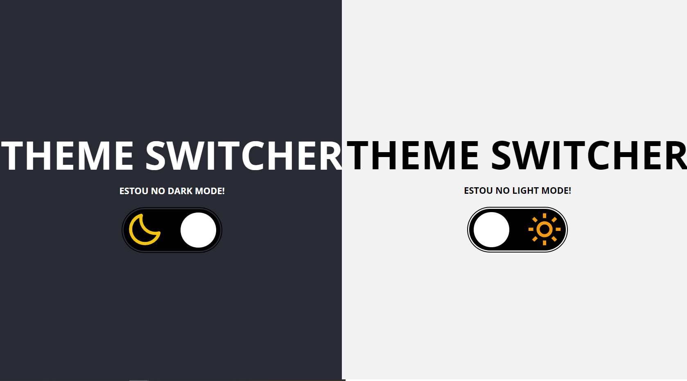
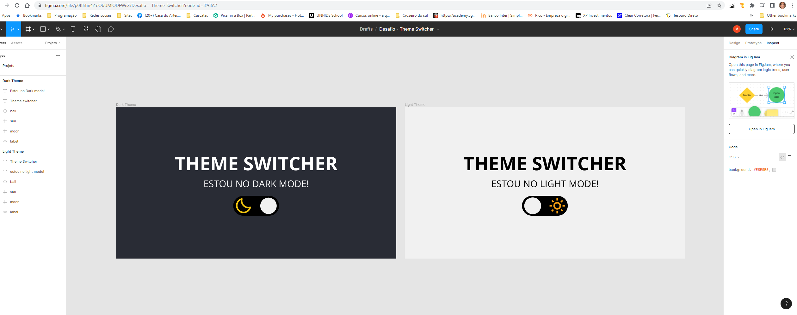

  

# Theme-switcher -> Rocketseat's Discover challenge

 

**Theme toggle switcher intermediate challenge**

---

	<a href="#about">About</a> •
  <a href="#functionalities">Functionalities</a> •
  <a href="#layouts">Layouts</a> •
	<a href="#tech-stack">Tech Stack</a> •
	<a href="#publication">Publication</a> •
	<a href="#author">Author</a> 

---

## About

Project developed as an apprentice exercise of **theme change (colors and styles) by clicking a button** proposed by Rocketseat, intended to give some practice and learning about:

- HTML, CSS and JavaScript;
- Better understand the integration of these 3 programming lanbguages;
- DOM's structure;
- Browser localStorage usage and application;

## Functionalities

- Modes -> By the click of a toggle button:

  - Choose beteween dark e light;
  - See different texts, colors and icons;

- Responsive -> Access this by Desktop or mobile;
- Access the page once, choose your preferred theme, and, coming back trough the same browser, your choosen theme will be automatically reloaded;

## Layout

<h1 align="center">
  
</h1>

### Using FIGMA

To reach this layout, based on the original project of _João Inácio (Biro)_ (@birobirobiro) and _Tamires Santos_ (@tfstam), provided by Rocketseat, I used FIGMA:

 

   
Click here for an image preview and also access the project

    
   

 

## Tech Stack

 
  
  
  
  

## Publication

 

To view that project published -> [Switch the theme](https://macedovin.github.io/Theme-switcher/)!

## Author

 

Projeto criado pela [Rocketseat](https://github.com/Rocketseat) e desenvolvido por [Vinicius&nbsp;Macedo](https://github.com/Macedovin).

&nbsp;
&nbsp;

 

### \* Como aprendido na Rocketseat, procuro manter a <strong>ACESSIBILIDADE</strong> nas aplicações.

  
